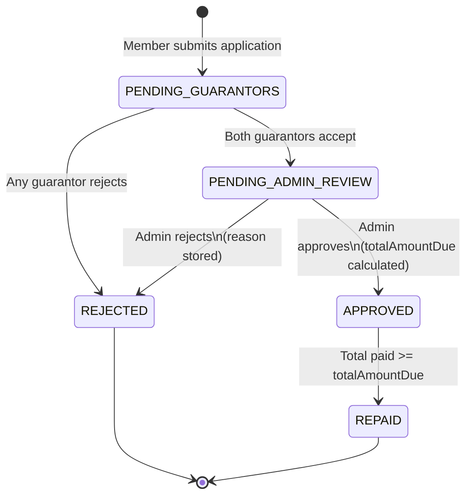

# Feature: Loans

> Related docs: [09_FEATURE_LOAN_REPAYMENT.md](./09_FEATURE_LOAN_REPAYMENT.md) | [10_FEATURE_WITHDRAWALS.md](./10_FEATURE_WITHDRAWALS.md)

---

## 1. Overview

The loan system allows cooperative members to borrow funds from the cooperative's pooled capital. Loans are anchored to a member's contribution history: the more a member has contributed, the larger the loan they can request. This creates a mutually reinforcing relationship — regular contributions grow borrowing power and sustain the fund from which all members can borrow.

Key characteristics of cooperative loans in this system:

- Loans are **peer-backed**: two fellow members must agree to act as guarantors before an admin can approve the application.
- Interest is **pre-calculated at approval time** using the cooperative's configured rate (simple interest, not compound).
- The full repayment obligation (`totalAmountDue`) is fixed at approval and does not change.
- Loan funds are **disbursed offline** (bank transfer, cash, etc.); the system manages the application workflow, not the actual payment.

---

## 2. Loan Eligibility Requirements

All of the following conditions must be satisfied before a loan application can be submitted. The system enforces each check server-side and returns a descriptive error if any condition fails.

| # | Requirement | How it is checked |
|---|-------------|-------------------|
| 1 | **Account is verified** | `user.verifiedAt` must be non-null (MEMBER role only; admins are exempt) |
| 2 | **At least one verified contribution on record** | `totalVerifiedContributions > 0` |
| 3 | **Loan amount does not exceed borrowing capacity** | `amount <= totalVerifiedContributions × borrowingMultiplier` |
| 4 | **Exactly two guarantors named** | Both `guarantor1Id` and `guarantor2Id` must be present and different from each other |
| 5 | **Neither guarantor is the applicant** | `guarantorId !== applicant.userId` |
| 6 | **Both guarantors are verified members** | `guarantor.verifiedAt` non-null for each |
| 7 | **Neither guarantor is an admin or owner** | `guarantor.role NOT IN (ADMIN, OWNER)` |
| 8 | **Both guarantors belong to the same cooperative** | Enforced in the database query |
| 9 | **Guarantor coverage check passes** | Depends on cooperative's `guarantorCoverageMode` (see Section 5) |

If any requirement is not met, the application is rejected with a clear error message explaining exactly which condition failed and (where applicable) what the shortfall is.

---

## 3. Borrowing Capacity

A member's **borrowing capacity** is the maximum loan amount they can request. It is calculated as:

```
Borrowing Capacity = Total Verified Contributions × Borrowing Multiplier
```

The borrowing multiplier is a cooperative-wide setting (default: **3×**). An admin or owner can change it in **Admin → Settings → Loan Settings**.

### Examples (default 3× multiplier)

| Total Verified Contributions | Multiplier | Borrowing Capacity |
|------------------------------|------------|--------------------|
| ₦10,000 | 3× | ₦30,000 |
| ₦50,000 | 3× | ₦150,000 |
| ₦100,000 | 3× | ₦300,000 |
| ₦200,000 | 3× | ₦600,000 |

Only **verified** contributions count toward borrowing capacity. Pending or rejected contributions have no effect. Contributions made as part of a loan repayment (payment method: `DIRECT_PAYMENT`) are verified immediately and therefore raise borrowing capacity right away.

---

## 4. Loan Application Process (Member)

### Navigation

**Dashboard → Loans → Apply for a Loan**

### Step-by-Step

1. **Open the application form** at `/dashboard/loans/apply`.
2. **Enter the loan amount.** The form enforces a minimum of ₦1,000 and a maximum equal to your borrowing capacity, shown below the input field.
3. **Describe the purpose** (optional free-text field — stored in the audit log for admin reference, not required for approval).
4. **Select First Guarantor** from the dropdown. Only verified, non-admin members are listed. Selecting one guarantor removes them from the second dropdown to prevent duplicates.
5. **Select Second Guarantor** from the remaining members.
6. **Submit.** The form is disabled until both guarantors are selected.

### Validation Errors and Remedies

| Error message | Cause | What to do |
|---------------|-------|------------|
| "Your account must be verified before applying for a loan." | `verifiedAt` is null | Contact your admin to complete account verification |
| "You must have at least one verified contribution to apply for a loan." | No verified contributions found | Submit a contribution and wait for admin verification |
| "Loan amount exceeds your borrowing capacity of ₦X" | Amount > contributions × multiplier | Reduce the amount, or make more contributions first |
| "The two guarantors must be different people." | Same person selected twice | Choose two distinct members |
| "You cannot be your own guarantor." | Applicant selected as guarantor | Choose two other members |
| "One or both guarantors are invalid." | Guarantor is admin/owner, deleted, or from a different cooperative | Choose active, non-admin members |
| "X is not verified and cannot act as a guarantor." | The named guarantor has not been verified | Ask the guarantor to contact admin, or choose a verified member |
| "Guarantors' combined contributions (₦X) must cover the loan amount (₦Y)." | COMBINED coverage mode active and guarantors under-contribute | Choose guarantors with higher total contributions, or reduce loan amount |
| "X's contributions (₦A) must individually cover the loan amount (₦B)." | INDIVIDUAL coverage mode active | Choose a guarantor whose contributions meet or exceed the loan amount |

---

## 5. Guarantor System

### What Is a Guarantor?

A guarantor is a fellow cooperative member who vouches for the borrower's ability to repay. By accepting, a guarantor is signalling trust in the applicant — and, depending on the cooperative's configuration, is demonstrating that their own contributions could back the loan if needed.

Guarantors do **not** make payments on behalf of the borrower in the system; their role is one of social and (optionally) financial attestation.

### Who Can Be a Guarantor?

| Can be a guarantor | Cannot be a guarantor |
|--------------------|----------------------|
| Verified members of the same cooperative | The applicant themselves |
| Members with MEMBER or TREASURER role | Members with ADMIN or OWNER role |
| Members whose accounts are active (not deleted) | Unverified members |
| | Members from a different cooperative |

### Guarantor Coverage Modes

The cooperative owner or admin sets a coverage mode in **Admin → Settings** that controls whether guarantors' contribution totals are checked at application time.

| Mode | What it checks | Example (₦100,000 loan) |
|------|---------------|-------------------------|
| `OFF` | No contribution check | Any two eligible members qualify regardless of contribution totals |
| `COMBINED` | G1 contributions + G2 contributions ≥ loan amount | G1 (₦40,000) + G2 (₦70,000) = ₦110,000 ≥ ₦100,000 — PASS |
| `INDIVIDUAL` | Each guarantor's contributions ≥ loan amount, independently | G1 must have ≥ ₦100,000 AND G2 must have ≥ ₦100,000 |

The active mode is displayed on the application form below the guarantor selectors, so members know what to expect before they submit.

### What Happens After Application Submission

Once a loan application is submitted:

1. Status is set to **PENDING_GUARANTORS**.
2. Both guarantors are immediately notified by email and SMS (subject to their notification preferences).
3. Each guarantor can log in and navigate to **Dashboard → Loans** to see the pending request and accept or decline.
4. If a guarantor declines, they must provide a written reason.

### Outcome of Guarantor Responses

| Scenario | Result |
|----------|--------|
| Both guarantors accept | Loan advances automatically to **PENDING_ADMIN_REVIEW** |
| Either guarantor rejects | Loan is immediately and automatically set to **REJECTED**; rejection reason is stored as `"Guarantor rejected: <their reason>"` |
| One accepted, one pending | Loan stays at **PENDING_GUARANTORS** until the second responds |

Once a guarantor has responded (accepted or rejected), they cannot change their response.

---

## 6. Loan Status Lifecycle



### Status Descriptions

| Status | Badge colour | Meaning |
|--------|-------------|---------|
| `PENDING_GUARANTORS` | Yellow / Warning | Waiting for both guarantors to respond |
| `PENDING_ADMIN_REVIEW` | Blue / Sky | Both guarantors accepted; awaiting admin decision |
| `APPROVED` | Green / Success | Admin approved; loan is active and repayments can be recorded |
| `REJECTED` | Red / Destructive | Declined by a guarantor or by an admin |
| `REPAID` | Grey / Secondary | All payments received; loan is closed |

---

## 7. Notification Timeline

| Event | Who is notified | Channel |
|-------|----------------|---------|
| Application submitted | Both guarantors | Email + SMS |
| Admin approves loan | Applicant | Email + SMS |
| Admin rejects loan | Applicant | Email only |
| Payment overdue (daily cron) | Borrower | Email + SMS |

All notifications respect individual member preferences (`emailNotifications`, `smsNotifications` fields on the user record). SMS requires a phone number to be on file and Twilio to be configured. If either is missing, the channel is silently skipped; the other channel still fires.

---

## 8. Loan Approval (Admin)

### Navigation

**Admin → Loans** — shows only loans in `PENDING_ADMIN_REVIEW` status.

### What the Admin Sees

Each card shows:
- Applicant name and email
- Amount requested
- Applicant's total verified contributions and computed borrowing capacity
- Each guarantor's name, acceptance status, and their own contribution total
- Whether guarantor coverage passes under the current mode (✓ Covered / ✗ Under-covered indicator)
- Application date

### Interest Calculation at Approval Time

When an admin approves a loan, the system reads the cooperative's current `loanInterestRate` and `loanRepaymentMonths` settings and calculates:

```
interest      = principal × (interestRate / 100)
totalAmountDue = principal + interest
monthlyPayment = totalAmountDue / repaymentMonths
```

These values are written to the loan record at the moment of approval and are **never recalculated** afterwards, even if the cooperative later changes its rate settings. This protects borrowers from retroactive rate increases.

**Example:** ₦100,000 at 10% over 12 months → `totalAmountDue = ₦110,000`, `monthlyPayment = ₦9,167`.

### Self-Approval Prevention

An admin cannot approve or reject their own loan application. If `loan.userId === admin.id`, the review action returns an error: `"You cannot approve your own loan application."` In practice, an admin who needs a loan should request it through the same member flow and have another admin review it.

---

## 9. Loan Configuration (Admin/Owner)

Located at **Admin → Settings → Loan Settings**. All fields accept numeric input and are validated server-side.

| Setting | Field name | Default | Validation | Effect |
|---------|-----------|---------|------------|--------|
| Interest rate | `loanInterestRate` | 10% | 0–100 | Applied to new approvals only |
| Repayment duration | `loanRepaymentMonths` | 12 months | 1–60 | Sets repayment schedule length |
| Grace period | `defaultGracePeriodDays` | 30 days | ≥ 0 | Number of days after a missed payment before status moves from BEHIND to DEFAULTED |
| Currency code | `currency` | NGN | Required | Display label |
| Currency symbol | `currencySymbol` | ₦ | Required | Displayed on all monetary values |

**Guarantor coverage mode** is a separate setting under **Admin → Settings** with three options: OFF, COMBINED, INDIVIDUAL (see Section 5).

**Borrowing multiplier** is stored on the cooperative record (`borrowingMultiplier`, default 3) and affects new applications immediately.

> **Important:** Changes to interest rate and repayment months only affect loans approved after the change. Existing active loans retain the rate and months that were locked in at the time of their approval.

---

## 10. Default Detection

The system continuously monitors active loans and categorises their health using the `calculateLoanHealth` function:

| Health status | Meaning |
|--------------|---------|
| `ON_TRACK` | Amount paid to date is on or ahead of schedule |
| `BEHIND` | Amount paid is less than expected, but within the grace period |
| `DEFAULTED` | Amount paid is less than expected and the grace period has elapsed |
| `REPAID` | All payments complete |

**Days overdue** is calculated as: days since the last missed due date minus the grace period. A loan is only flagged DEFAULTED once `daysOverdue > 0` (i.e., the grace period has been exceeded).

### Overdue Notification Cron Job

A scheduled endpoint (`GET /api/cron/check-overdue`) runs daily (configured externally, e.g., via Vercel Cron at 08:00 UTC). It:

1. Loads all loans with status `APPROVED` and no `repaidAt`.
2. Computes `calculateLoanHealth` for each using the cooperative's `defaultGracePeriodDays`.
3. Sends an overdue notification (email + SMS) to the borrower for any loan with health `BEHIND` or `DEFAULTED` and `daysOverdue > 0`.
4. De-duplicates: skips borrowers who already received a `PAYMENT_OVERDUE` notification in the last 23 hours.

Loans flagged as DEFAULTED also appear in admin reports under the Loan Decisions report, which can be exported as PDF or CSV.

---

## 11. Troubleshooting

### "My guarantor rejected my application — what now?"

When a guarantor rejects, the loan is permanently closed as REJECTED. You must submit a new application. You may choose different guarantors or address the reason the original guarantor gave. There is no mechanism to reopen a rejected application.

### "My borrowing capacity is too low to cover the amount I need."

Borrowing capacity grows as you make more verified contributions. To increase it:
1. Submit contributions and have them verified by your admin.
2. Contributions made as part of a loan repayment split are verified immediately (no admin action needed).
3. Ask your admin whether the cooperative's borrowing multiplier can be increased.

### "The guarantor I want to use is not showing in the dropdown."

The dropdown only shows verified, active, non-admin members of your cooperative. The missing member may:
- Not yet be verified (they need to contact the admin)
- Have an admin or owner role (ineligible)
- Have been removed from the cooperative

### "I submitted an application but it is stuck on PENDING_GUARANTORS."

One or both guarantors have not yet responded. They should receive an email and SMS notification. If they did not, check that their notification settings are enabled and that their phone number is on file. They can also find the pending request by navigating to **Dashboard → Loans**.

### "The admin rejected my loan after both guarantors accepted — why?"

Possible reasons include policy decisions, irregular account activity, or insufficient cooperative funds. The rejection reason is stored and visible to the applicant. Contact your admin for clarification if the reason is unclear.
