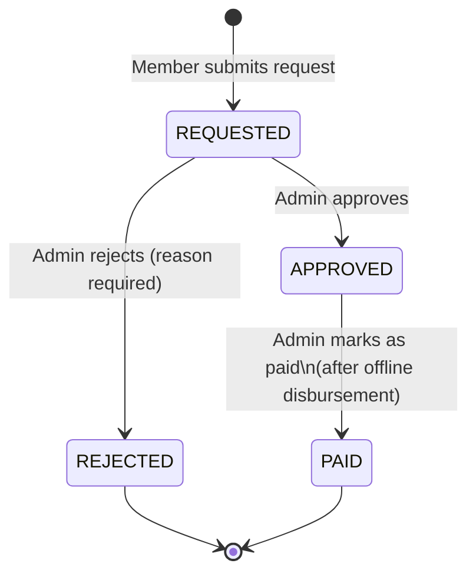

# Feature: Withdrawal Requests

> Related docs: [08_FEATURE_LOANS.md](./08_FEATURE_LOANS.md) | [09_FEATURE_LOAN_REPAYMENT.md](./09_FEATURE_LOAN_REPAYMENT.md)

---

## 1. Overview

Withdrawals allow members to reclaim some or all of their contributed funds from the cooperative. They are fundamentally different from loans:

| | Loan | Withdrawal |
|--|------|------------|
| Nature | Borrowing from the fund | Returning contributed capital |
| Repayment required | Yes — with interest | No |
| Effect on contributions | None | Reduces the member's total verified contributions |
| Effect on borrowing capacity | Temporarily blocked while active loan exists | Permanently reduced for future loan applications |

Because withdrawals reduce the cooperative's pooled capital, they require admin approval and are subject to an available-balance check. Funds are disbursed **offline** (bank transfer, cash, etc.); the system manages the request workflow, not the actual payment.

---

## 2. Available Balance Calculation

The maximum a member can withdraw at any given time is their **available withdrawal balance**:

```
available = totalVerifiedContributions − activeOutstandingLoanBalance
```

Where:

- `totalVerifiedContributions` = sum of all `VERIFIED` contribution amounts for the member
- `activeOutstandingLoanBalance` = `totalAmountDue − totalPaid` for any currently active (`APPROVED`, not repaid) loan

If the member has no active loan, the available balance equals their total verified contributions. If they have an active loan, the remaining loan balance is reserved and cannot be withdrawn until repaid.

**Example:**

| Scenario | Total Contributions | Active Loan Balance | Available to Withdraw |
|----------|--------------------|--------------------|----------------------|
| No active loan | ₦150,000 | ₦0 | ₦150,000 |
| Active loan, partially repaid | ₦150,000 | ₦60,000 | ₦90,000 |
| Active loan exceeds contributions | ₦50,000 | ₦80,000 | ₦0 |
| No contributions | ₦0 | ₦0 | ₦0 |

> **Note:** The available balance calculation considers only one active loan at a time (the system enforces a single active loan per member). The `Math.max(0, ...)` guard ensures the available balance never goes negative.

---

## 3. Requesting a Withdrawal (Member)

### Prerequisites

- Account must be **verified** (`verifiedAt` non-null)
- Must have a positive available balance
- Must not have an existing **REQUESTED** (pending) withdrawal — only one open request is permitted at a time

If a member already has a pending request and attempts to submit another, the system returns: `"You already have a pending withdrawal request."`

### Navigation

**Dashboard → Withdrawals** (`/dashboard/withdrawals`)

The page displays the current available balance and a form to submit a new request (if no request is already pending).

### Withdrawal Form Fields

| Field | Required | Options / Notes |
|-------|----------|----------------|
| Amount | Yes | Must be > 0 and ≤ available balance |
| Reason | Yes | Personal Use, Emergency, Leaving Cooperative, Other |
| Notes | No | Free text for additional context |

The `Reason` field is a dropdown with four valid options (`PERSONAL`, `EMERGENCY`, `LEAVING`, `OTHER`). The system validates the submitted value server-side against this list.

### Step-by-Step

1. Navigate to **Dashboard → Withdrawals**.
2. Review your **Available Balance** shown above the form.
3. Enter the **amount** you wish to withdraw (up to the available balance).
4. Select a **reason** from the dropdown.
5. Optionally add **notes** to give the admin more context.
6. Click **Request Withdrawal**.
7. On success, the page refreshes and shows the new request with **Requested** status. You will not be able to submit another request until this one is resolved.

**Timeline expectation:** Requests require admin review. There is no guaranteed turnaround time; contact your admin if urgency applies.

---

## 4. Withdrawal Status Flow



### Status Badge Descriptions

| Status | Badge | What it means for the member |
|--------|-------|-------------------------------|
| **REQUESTED** | Yellow / Warning | Your request is pending admin review. No action required from you at this stage. |
| **APPROVED** | Green / Success | Admin has approved the amount. Funds will be disbursed to you shortly (offline transfer). |
| **REJECTED** | Red / Destructive | Request was declined. The rejection reason is stored and visible. You can submit a new request after addressing the reason. |
| **PAID** | Blue / Sky | Funds have been disbursed. The withdrawal is complete. |

### Notification Events

| Event | Who is notified | Channel |
|-------|----------------|---------|
| Request approved | Member | Email + SMS |
| Request rejected | Member | Email + SMS |
| Marked as paid | Member | Email + SMS |

All notifications respect individual member preferences (`emailNotifications`, `smsNotifications`). SMS requires a phone number on file.

---

## 5. Impact on Borrowing Capacity

A withdrawal request that reaches **PAID** status permanently reduces the member's total verified contributions. Since borrowing capacity is `totalVerifiedContributions × borrowingMultiplier`, a ₦50,000 withdrawal at 3× multiplier reduces borrowing capacity by ₦150,000.

**Example:**

| Before withdrawal | After ₦50,000 withdrawal paid |
|------------------|-------------------------------|
| Contributions: ₦150,000 | Contributions: ₦100,000 |
| Borrowing capacity (3×): ₦450,000 | Borrowing capacity (3×): ₦300,000 |

> **Important:** An approved-but-not-yet-PAID withdrawal does not change the contribution total in the database — only disbursement (PAID status) matters for borrowing capacity, because the withdrawal amount is not deducted from the `Contribution` table; rather, future loan applications recompute capacity from the remaining contributions.

> **Note on implementation:** The current system does not deduct a separate "withdrawal record" from the contribution aggregate. The available balance formula (contributions minus active loan balance) is the operative constraint at withdrawal request time. After a withdrawal is disbursed, the cooperative's pooled capital decreases in practice; reconciliation of the member's contribution total for future loan applications relies on the admin's offline bookkeeping or a future contribution-reduction feature.

---

## 6. Admin Approval Process

### Navigation

**Admin → Withdrawals** (`/admin/withdrawals`)

The page shows all withdrawal requests grouped by status. Pending requests (REQUESTED) are shown first.

### What the Admin Sees for Each Request

- Member name and email
- Amount requested
- Reason (e.g., "Personal Use")
- Notes (if provided by member)
- Date submitted
- Current status

### Approval Actions

Three actions are available on each request, depending on its current status:

| Action | Available when | What it does |
|--------|---------------|-------------|
| **Approve** | Status = REQUESTED | Sets status to APPROVED, records `approvedAt` and `approvedBy`; notifies member |
| **Reject** | Status = REQUESTED | Requires a written reason; sets status to REJECTED; notifies member |
| **Mark Paid** | Status = APPROVED | Sets status to PAID, records `paidAt`; notifies member |

The two-step approve → paid flow reflects the offline nature of cooperative disbursements: approval signals intent, and "Mark Paid" is a separate confirmation that the money has physically left the cooperative.

### Reject Flow

When rejecting, the admin must provide a rejection reason using the inline form. This reason:
- Is stored in `withdrawalRequest.rejectionReason`
- Is included in the notification email and SMS sent to the member
- Is visible to the member on their withdrawal history page

### Self-Withdrawal Note

There is no server-side restriction preventing an admin from approving their own withdrawal request (unlike loans, which block self-approval). Cooperative governance policy should address this; consider requiring a second admin to handle requests from admins.

---

## 7. Common Rejection Reasons

Admins should provide a clear, actionable reason so members understand what to address. Common examples:

| Rejection reason | Explanation for member |
|-----------------|----------------------|
| Insufficient balance | The amount requested exceeds your available withdrawal balance at this time |
| Outstanding loan balance | You have an active loan; the outstanding balance reduces your available withdrawal amount |
| Incomplete documentation | Additional documents were requested; contact admin |
| Cooperative reserves policy | The cooperative is maintaining minimum reserves and cannot release funds at this time |
| Pending contribution verification | Some of your contributions are awaiting verification; retry after they are verified |
| Duplicate request | A previous request for the same amount was already processed |

The rejection reason text is free-form — admins can write any explanation. The examples above are guidelines only.

---

## 8. Tracking Status (Member)

Members can view the history of all their withdrawal requests on **Dashboard → Withdrawals** (`/dashboard/withdrawals`).

The page shows a list of past and current requests ordered by submission date (most recent first), including:

- Amount
- Reason
- Status badge
- Submission date
- Approval date (if approved)
- Payment date (if paid)
- Rejection reason (if rejected)

Members receive real-time email and SMS notifications at each status transition, so active monitoring of the page is not strictly necessary.

---

## 9. Troubleshooting

### "My request has been pending for a long time."

There is no system-enforced review deadline. Contact your cooperative administrator directly. If your request is urgent (e.g., medical emergency), mention this when following up.

### "My request was rejected but the reason is unclear."

The rejection reason set by the admin is displayed on your withdrawal history page and included in the notification email. If it is still unclear after reading it, contact your admin and reference the withdrawal ID (visible in the URL or request record).

### "My available balance appears lower than my total contributions."

This is expected if you have an active loan with an outstanding balance. The available balance formula deducts your remaining loan balance:

```
available = totalVerifiedContributions − activeOutstandingLoanBalance
```

To increase your available balance, repay more of your loan.

If you have no active loan but the balance still looks wrong:
1. Check whether any of your contributions are still in `PENDING_VERIFICATION` status — these do not count.
2. Confirm with your admin that all expected contributions have been verified.
3. Check whether a previous withdrawal was processed (PAID) that reduced the contribution pool.

### "I want to cancel a pending request."

The system does not currently provide a self-service cancel button. Contact your admin and ask them to reject the request with a note such as "Cancelled by member request." This frees you to submit a new request immediately.

### "I submitted a withdrawal but now I cannot submit another."

Only one pending (`REQUESTED`) withdrawal is allowed at a time. Your existing request must be resolved (approved, rejected, or paid) before you can submit a new one. If you need to change the amount, contact your admin to reject the current request so you can resubmit.
