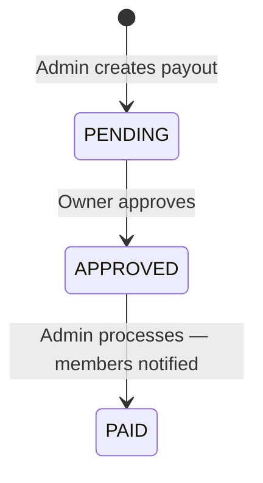

# Dividend Distribution

Cooperative Manager provides a structured dividend distribution system that lets administrators calculate and pay profit shares to members based on their verified contribution percentage.

> **Related:** [Reporting & Analytics](13_FEATURE_REPORTING.md) — dividend totals appear in the cooperative overview report. [Member Guide](01_MEMBER_GUIDE.md) — how members view their expected and received dividends.

---

## What Are Dividends?

When a cooperative generates a financial surplus for a period, that surplus is distributed to members as dividends. Rather than a flat payout, Cooperative Manager distributes dividends **proportionally**: members who have contributed more to the cooperative receive a larger share of the pool.

Dividends are based exclusively on **verified contributions**. Pending or rejected contributions are not counted. This ensures only confirmed financial activity is rewarded.

Dividend payouts are period-based — each payout covers a specific quarter or full year and is independent of other periods.

---

## Dividend Calculation Formula

### Step 1 — Calculate the Dividend Pool

```
dividendPool = totalProfit − adminCosts − loanLossReserve
```

Where:

- `adminCosts` = totalProfit × (adminCostsPct ÷ 100)
- `loanLossReserve` = totalProfit × (loanLossReservePct ÷ 100)

The system validates that `adminCostsPct + loanLossReservePct < 100`, ensuring the pool is always positive.

### Step 2 — Calculate Each Member's Contribution Percentage

```
memberContributionPct = memberVerifiedContributions ÷ totalCooperativeVerifiedContributions × 100
```

### Step 3 — Calculate Each Member's Dividend Amount

```
memberDividendAmount = memberContributionPct × dividendPool ÷ 100
```

### Worked Example

**Scenario:** Lagos Savings Cooperative closes Q1 2026 with a total profit of ₦500,000.

| Input | Value |
|---|---|
| Total Profit | ₦500,000 |
| Admin Costs (10%) | ₦50,000 |
| Loan Loss Reserve (20%) | ₦100,000 |
| **Dividend Pool** | **₦350,000** |

**Member contributions for the period:**

| Member | Verified Contributions | Share of Total |
|---|---|---|
| Fatima Bello | ₦200,000 | 10% |
| Emeka Nwosu | ₦500,000 | 25% |
| Other members | ₦1,300,000 | 65% |
| **Total** | **₦2,000,000** | **100%** |

**Fatima's dividend:**
```
10% × ₦350,000 ÷ 100 = ₦35,000
```

**Emeka's dividend:**
```
25% × ₦350,000 ÷ 100 = ₦87,500
```

The dividend shares are calculated automatically at the moment of payout creation. Any contributions verified after payout creation are not retroactively included.

---

## Payout Status Flow



| Status | Meaning |
|---|---|
| PENDING | Payout created; awaiting owner approval |
| APPROVED | Owner has approved; ready to process |
| PAID | Processed; each member's MemberDividend marked PAID |

---

## Creating a Dividend Payout (Admin/Owner)

### Who Can Create Payouts

Only users with the **ADMIN** or **OWNER** role can access the dividend management page.

### Steps

1. Navigate to **Admin → Dividends** (`/admin/dividends`).
2. Click **Create New Payout** or fill in the form displayed at the top of the page.
3. Enter the following fields:

| Field | Required | Notes |
|---|---|---|
| Period | Yes | Q1, Q2, Q3, Q4, or ANNUAL |
| Year | Yes | 2000–2100 |
| Total Profit | Yes | Must be a positive number |
| Admin Costs % | Yes | Percentage of profit allocated to admin costs (0–99) |
| Loan Loss Reserve % | Yes | Percentage set aside as a safety buffer (0–99) |

> The combined admin costs % and loan loss reserve % must be less than 100%, otherwise the system returns a validation error.

4. The system immediately calculates the dividend pool and the per-member share table based on current verified contributions.
5. Review the preview table showing each member's contribution amount, percentage, and expected dividend.
6. Submit to create the payout.

### What the System Does on Creation

- Creates a `DividendPayout` record with status `PENDING`.
- Creates one `MemberDividend` record per member with a verified contribution, storing `contributionPct` and `amount`.
- Records a `dividend_payout_created` event in the audit trail.

---

## Approval Process

### Stage 1 — Review (PENDING)

After creation, the payout sits in PENDING status. An owner or admin reviews the member share table to confirm the figures are correct before approving.

To approve:
1. On the **Admin → Dividends** page, find the payout row.
2. Click **Approve** in the Action column.
3. The status updates to **APPROVED** and an `approvedAt` timestamp is recorded.

### Stage 2 — Processing (APPROVED → PAID)

Once approved, the payout can be processed.

1. Click **Process** in the Action column of the approved payout.
2. The system runs a database transaction that:
   - Updates every `MemberDividend` for this payout to status `PAID` with a `paidAt` timestamp.
   - Updates the `DividendPayout` status to `PAID`.
   - Records a `dividend_payout_processed` event in the audit trail.
3. After the transaction, **email and SMS notifications** are sent to every member who received a dividend (fire-and-forget; does not block the response).

---

## Member Notifications

When a payout is processed, each member whose `MemberDividend` was updated to `PAID` receives:

- **Email** — subject: "Your dividend of ₦X has been paid" — includes the payout amount and a prompt to log in.
- **SMS** — short message: "[Cooperative Name]: Dividend of ₦X paid to your account!"

Notifications are only sent if the member has **email notifications** or **SMS notifications** enabled in their preferences (`/dashboard/settings/notifications`). Members with no phone number on file do not receive SMS.

---

## Member Visibility

### Before Payment — Expected Dividend

When a `MemberDividend` record exists with status `PENDING`, the amount is displayed on the member's **Financial Summary** dashboard under the label **Expected Dividend** (or "Pending Dividend" on the stat card). This signals that a payout has been created and the member's share has been calculated, but money has not yet been released.

### After Payment — Dividend History

Once the payout is processed and the `MemberDividend` status changes to `PAID`, the amount appears in the member's **Total Dividends Received** figure on the Financial Summary page. The stat card label changes from "Pending Dividend" to "Dividends Received".

### Downloading a Statement

Members can download a PDF financial statement from `/dashboard/financial-summary` that includes their total dividends received to date. See [Reporting & Analytics](13_FEATURE_REPORTING.md) for more on PDF exports.

---

## The Loan Loss Reserve — Why It Matters

The loan loss reserve percentage is deducted from profit before calculating the dividend pool. This money remains in the cooperative's fund to cover loans that default or are difficult to recover.

**Best practices for Nigerian cooperatives:**

| Scenario | Recommended Reserve % |
|---|---|
| Low-risk membership, strong repayment history | 5–10% |
| Mixed repayment performance | 15–20% |
| High loan activity or new cooperative | 20–30% |

A reserve that is too small leaves the cooperative exposed if multiple loans go bad. A reserve that is too large unnecessarily reduces member dividends and may discourage contributions.

The reserve percentage is not stored as a cooperative setting — it is entered fresh each time a payout is created, allowing the board to adjust based on the current risk climate.

---

## Compliance and Audit Trail

Every dividend action is recorded in the cooperative's audit trail:

| Event | When Recorded |
|---|---|
| `dividend_payout_created` | When admin creates the payout |
| `dividend_payout_approved` | When owner approves |
| `dividend_payout_processed` | When admin triggers payment |

These records are visible in **Admin → Reports → Audit Trail** and are included in the cooperative's payout history table at **Admin → Dividends**. The payout history table shows period, total profit, dividend pool, member count, status, and paid date for every payout ever created.

For board meetings, the payout history provides a clear record of how profits were distributed each period and who authorised each step.

---

## Troubleshooting

### A member is not receiving a dividend

The most common cause is that the member had no verified contributions at the time the payout was created. Dividend shares are calculated from the `contribution.groupBy` query at creation time, not retrospectively.

To verify: go to **Admin → Reports → Contributions** and confirm the member has verified contribution entries for the period in question. If they do not, their contributions may be in PENDING or REJECTED status.

### Dividend amounts appear wrong

Check whether any large contributions were recently verified or rejected that significantly shifted the cooperative total. The payout uses the live verified-contribution totals at the moment of creation. If the payout was created before a large contribution was verified, the affected member's share will be understated.

If corrections are needed, the existing payout must remain as-is (PENDING payouts cannot be edited). Create a corrective payout for a separate period to make up the difference, or contact your cooperative's financial officer.

### Notifications were not sent

Notifications are sent outside the database transaction as fire-and-forget calls. If a notification failed silently, confirm the following in your environment configuration:

- `RESEND_API_KEY` is set and valid (email delivery)
- `TWILIO_ACCOUNT_SID`, `TWILIO_AUTH_TOKEN`, and `TWILIO_PHONE_NUMBER` are all set (SMS delivery)
- The member's email address is correct and their email notifications preference is enabled
- The member's phone number is in valid international format (e.g., +2348012345678) and SMS notifications are enabled

See [Announcements & Notifications](12_FEATURE_ANNOUNCEMENTS.md) for more on the notification delivery system.

### Cannot create a payout — "No verified contributions found"

This error means no members in the cooperative have any verified contributions. At least one member must have at least one verified contribution before a payout can be created. Verify contributions at **Admin → Contributions**.

### Cannot approve — "Payout is not pending"

The payout has already been approved or paid. Each payout can only be approved once. Check the status column on the Dividends page.

### Cannot process — "Payout must be approved before processing"

The approval step was skipped or the payout is still in PENDING status. Approve first, then process.
