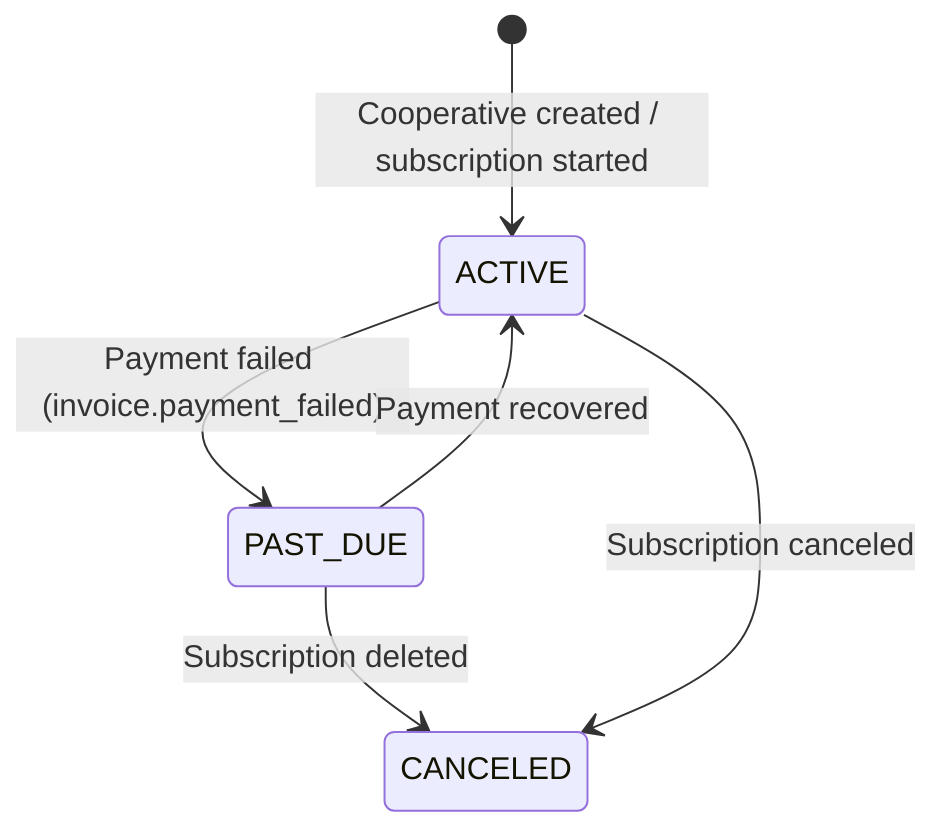

# Multi-Tenancy

Cooperative Manager is a multi-tenant SaaS: a single deployed instance and shared PostgreSQL database serves multiple independent cooperatives simultaneously. Each cooperative's data is completely isolated from every other — members of Lagos Savings Cooperative cannot see, access, or influence any data belonging to Abuja Credit Union, and vice versa.

> **Related:** [Authentication](05_FEATURE_AUTHENTICATION.md) — how sessions establish the tenant context. [Reporting & Analytics](13_FEATURE_REPORTING.md) — all reports are automatically scoped to the logged-in tenant.

---

## What Is Multi-Tenancy?

In a traditional single-tenant setup, each cooperative would have its own separate database and deployment. Multi-tenancy uses a single deployment and a single database, with a tenant identifier on every row separating one organisation's data from another.

**Benefits for cooperatives:**
- No infrastructure costs per cooperative — one platform, shared operational expenses
- Upgrades and bug fixes are applied once and benefit all tenants immediately
- Members and admins use the same domain and interface regardless of which cooperative they belong to

**The tenant identifier in Cooperative Manager is `cooperativeId`** — a unique identifier for each cooperative stored on every data table.

---

## Data Model

Every significant table in the database carries a `cooperativeId` foreign key:

| Table | cooperativeId Role |
|---|---|
| `User` | Every user belongs to exactly one cooperative |
| `Contribution` | Each contribution is scoped to one cooperative |
| `LoanApplication` | Each loan application is scoped to one cooperative |
| `LoanGuarantor` | Guarantor relationships are within one cooperative |
| `LoanRepayment` | Repayments are associated with loans in one cooperative |
| `DividendPayout` | Payouts are created per cooperative |
| `MemberDividend` | Individual dividend records carry cooperativeId |
| `WithdrawalRequest` | Withdrawal requests are scoped to one cooperative |
| `Announcement` | Announcements belong to one cooperative |
| `AnnouncementRsvp` | RSVPs are within one cooperative's announcement |
| `Event` | All audit events are cooperative-scoped |
| `Notification` | All notification records are cooperative-scoped |
| `CooperativeBank` | Bank accounts belong to one cooperative |

The `Cooperative` table itself is the root — it is the only table without a `cooperativeId` because it is the tenant itself.

---

## Cooperative Isolation

### Query-Level Enforcement

Every Prisma query in the application includes a `where: { cooperativeId }` clause sourced from the authenticated session. This means the database engine itself enforces the boundary — even if application code had a bug in its routing logic, a query that did not include the cooperativeId filter would return data only for the cooperative whose ID was supplied, not data from other cooperatives.

**Example — the contribution report query:**
```
prisma.contribution.findMany({
  where: { cooperativeId, deletedAt: null },
  ...
})
```

Substituting a different cooperative's ID is not possible for an authenticated user because the `cooperativeId` comes from the session, not from a URL parameter or request body field.

### No Cross-Cooperative Queries

There are no admin-level queries in the application that aggregate across all cooperatives. Even the platform-level Stripe billing webhook only updates the cooperative it can identify via `stripeCustomerId` — it never reads or modifies another cooperative's row.

---

## Session-Based Tenant Enforcement

### How cooperativeId Is Established

When a user signs in, the server validates their session token against the database. The session object includes `session.user.cooperativeId`, populated from the `User.cooperativeId` column at authentication time.

This cooperativeId is then passed to every server action and API route that reads or writes data. It is never taken from:

- URL path parameters (e.g., `/admin/reports?coop=coop-abuja-002`)
- Request body fields supplied by the client
- HTTP headers

Because the cooperativeId comes exclusively from the server-side session, it **cannot be spoofed** by a malicious client. A member logged in to Lagos Savings Cooperative cannot craft a request that reads Abuja Credit Union's data.

### Verification in Server Actions

Every server action that performs data operations calls one of the following guard functions before doing any database work:

| Guard Function | When Used |
|---|---|
| `requireAuth()` | Any action requiring a logged-in user |
| `requireCooperativeAccess(cooperativeId)` | Verifies the session user's cooperativeId matches the supplied value |
| `protectVerifiedAction(cooperativeId)` | As above, plus checks the member is verified |
| `protectAdminAction(cooperativeId)` | As above (for admins), role must be ADMIN or OWNER |

All of these functions throw immediately if the check fails, preventing any data access.

---

## Joining a Cooperative

### Owner — Creating a New Cooperative

When a user signs up and selects **Create a new cooperative**, a new `Cooperative` record is created and the signing-up user is assigned the **OWNER** role with `verifiedAt` set immediately. The owner does not go through a verification queue.

### Member — Joining an Existing Cooperative

When a user signs up and selects an existing cooperative from the list, their account is created with:
- `role: MEMBER`
- `cooperativeId` set to the selected cooperative
- `verifiedAt: null` (unverified; must be approved by an admin)

The signup endpoint at `/api/auth/cooperatives` returns a list of all active cooperatives so users can find and select theirs.

### No Cross-Membership

A user account belongs to exactly one cooperative. The `User.email` column has a **global unique constraint** — a given email address can only have one account on the platform, across all cooperatives. If a person needs to be a member of two cooperatives, they would need two different email addresses.

---

## Cooperative Settings

Each cooperative independently configures its own operational parameters. Settings are stored on the `Cooperative` record and apply only to that cooperative:

| Setting | Default | Notes |
|---|---|---|
| Borrowing Multiplier | 3× | Determines how much members can borrow relative to contributions |
| Guarantor Coverage Mode | COMBINED | OFF, COMBINED, or INDIVIDUAL |
| Loan Interest Rate | 10% | Applied to all new loans |
| Loan Repayment Months | 12 | Default duration for new loans |
| Default Grace Period Days | 30 | Days before a loan is considered overdue |
| Currency | NGN | ISO currency code |
| Currency Symbol | ₦ | Displayed in UI and notifications |

Changes to these settings by Cooperative A have no effect whatsoever on Cooperative B's configuration.

Settings are managed at **Admin → Settings** and restricted to ADMIN and OWNER roles within that cooperative.

---

## Member Management Within a Tenant

### Admin Responsibilities

Administrators can only act on members of their own cooperative. The member management UI at `/admin/members` lists only the users whose `cooperativeId` matches the admin's own. Verification, role changes, and member deletion are all scoped accordingly.

### Verification

New members joining an existing cooperative are unverified by default. An admin or owner of that cooperative verifies them — no admin from another cooperative has any visibility into or control over this queue.

### Role Assignment

Roles within a cooperative (MEMBER, ADMIN, TREASURER, OWNER) are scoped entirely to that cooperative. An OWNER of Lagos Savings Cooperative has no privileges at Abuja Credit Union, even though both accounts share the same platform.

---

## Security Implications

### What Multi-Tenancy Protects

- **Data confidentiality** — member names, contribution amounts, loan details, dividend figures, and audit trails are never exposed outside the cooperative boundary.
- **Action isolation** — approvals, rejections, and setting changes in one cooperative have no effect on another.
- **Notification isolation** — email and SMS notifications reference only the sending cooperative's data.

### What Admin Access Means

Within a cooperative, the OWNER and ADMIN roles have broad access: they can see all members' financial data, approve or reject any transaction, configure cooperative settings, and export all reports. Assign admin roles carefully. The audit trail records every admin action so accountability is maintained.

### What Is Not Protected by Multi-Tenancy

Multi-tenancy does not protect against:

- An admin abusing their privileges within their own cooperative (mitigated by the audit trail and cooperative governance)
- A member guessing another member's account credentials (mitigated by password hashing and session-based auth)
- Platform-level access by the system operator (a platform administrator with direct database access can query any cooperative's data — relevant for the SaaS operator, not end users)

---

## Data Isolation Audit

To verify that a query is correctly scoped to a cooperative, confirm that every `prisma.<model>.findMany`, `findFirst`, `findUnique`, `aggregate`, `groupBy`, or `count` call in the codebase includes `where: { cooperativeId }` (either directly or as part of a broader where clause).

Mutation calls (`create`, `update`, `updateMany`, `delete`) should either:
- Include `cooperativeId` in the `where` clause, or
- Have been preceded by a `findUnique` that verified the record's `cooperativeId` belongs to the session user before proceeding

The `protectAdminAction` and `protectVerifiedAction` guard functions ensure the cooperativeId supplied in a form post matches the session user's cooperative, preventing a cross-tenant mutation attempt.

---

## Billing

### Subscription Model

Each cooperative is billed independently via Stripe. The `Cooperative` table stores:

| Field | Purpose |
|---|---|
| `stripeCustomerId` | Stripe customer identifier (unique per cooperative) |
| `stripeSubscriptionId` | Active Stripe subscription identifier |
| `subscriptionStatus` | ACTIVE, PAST_DUE, or CANCELED |
| `billingCycleEnd` | Date the current billing period ends |

### Subscription Status Flow



| Status | Meaning |
|---|---|
| ACTIVE | Subscription is current; full platform access |
| PAST_DUE | Last payment failed; access may be restricted pending recovery |
| CANCELED | Subscription ended; cooperative data is retained but active access is suspended |

### How Billing Is Updated

Stripe sends webhook events to `/api/webhooks/stripe`. The webhook handler updates the cooperative's `subscriptionStatus` and `billingCycleEnd` fields based on the Stripe event type:

| Stripe Event | Action |
|---|---|
| `customer.subscription.created` | Sets status to mapped value, stores `billingCycleEnd` |
| `customer.subscription.updated` | Updates status and `billingCycleEnd` |
| `customer.subscription.deleted` | Sets status to CANCELED, clears `billingCycleEnd` |
| `invoice.payment_failed` | Sets status to PAST_DUE |

The webhook uses the `stripeCustomerId` to identify which cooperative to update — it never modifies any other cooperative's record.

### Managing Billing

Cooperative owners can manage their subscription (update payment method, view invoices, cancel) via the **Billing Portal** at **Admin → Billing**, which redirects to a Stripe-hosted customer portal session. The owner is returned to the application after completing their billing action.

### Data Retention After Cancellation

Canceling a subscription does not delete cooperative data. All contribution records, loan history, dividend payouts, audit trail events, and member records are retained in the database. This allows cooperatives to re-subscribe and resume operations, or to export their data before departing the platform.
