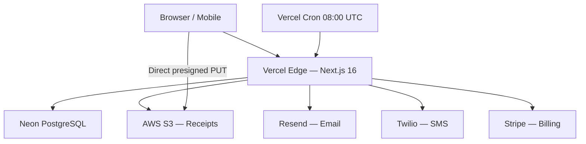

# 15 — System Architecture

## 1. High-Level Overview

Cooperative Manager is a multi-tenant SaaS platform for savings-and-credit cooperatives. Each tenant (cooperative) is isolated by a `cooperativeId` foreign key present on every domain table. A single PostgreSQL database serves all tenants; there is no row-level security — isolation is enforced entirely at the application layer by session inspection.

### Technology choices

| Concern | Choice | Rationale |
|---|---|---|
| Framework | Next.js 16.2.3 (App Router) | Server Components + Server Actions eliminate separate API boilerplate; edge-compatible |
| UI | React 19, Tailwind CSS v4, shadcn/ui | Component library built on Radix primitives; unstyled base keeps bundle lean |
| ORM | Prisma 7 | Type-safe queries, migration tooling, Decimal support for monetary fields |
| Database | PostgreSQL on Neon | Serverless connection pooling; branching for preview envs |
| Auth | Better-auth | Session stored in DB; email/password + email verification; extensible plugin model |
| File storage | AWS S3 (presigned URLs) | Browser uploads directly to S3 — server never handles binary payloads |
| Email | Resend | Transactional email with delivery status; minimal setup |
| SMS | Twilio (optional) | Gracefully degrades when env vars absent |
| PDF | jsPDF 4.2.1 + jspdf-autotable 5.0.7 | Client-side only; no server resources consumed |
| Billing | Stripe | Subscription lifecycle; webhook handler at `/api/webhooks/stripe` |
| Deployment | Vercel | Serverless functions; built-in cron support via `vercel.json` |

---

## 2. System Components Diagram



All server-side logic runs as Vercel Serverless Functions. There is no long-running process; every function invocation is stateless.

---

## 3. Request Flow

```
Browser
  │  HTTP request (page navigation or form submit)
  ▼
Vercel Edge Network
  │  Routes to Next.js runtime
  ▼
Next.js App Router
  │  Server Component renders / Server Action invoked
  ▼
app/lib/auth-helpers.ts  ← requireAuth() / protectAdminAction()
  │  Validates session cookie against DB
  ▼
app/actions/*.ts  (Server Action)
  │  Business logic, validation, Prisma calls
  ▼
Prisma 7 Client
  │  Parameterised SQL
  ▼
Neon PostgreSQL
  │  Query result
  ▼
Server Action returns { error?, success? }
  ▼
React useActionState updates UI (no full page reload)
```

For page navigations, Server Components fetch data directly via Prisma and stream HTML to the browser. For mutations, the client submits a form; `useActionState` manages pending/error/success state.

---

## 4. Authentication Flow

```
1. User submits /auth/signin form
2. better-auth validates email + password hash (bcrypt)
3. Session row inserted into `session` table (expires in 30 days)
4. Secure HttpOnly session cookie set on response
5. Subsequent requests include the cookie automatically
6. requireAuth() calls auth.api.getSession({ headers })
     → reads cookie → looks up session row → returns session object
7. protectAdminAction(cooperativeId):
     → requireAuth() → checks role is ADMIN or OWNER
     → DB lookup confirms user.cooperativeId === cooperativeId
     → returns session or throws Forbidden
```

Session cookie cache is disabled (see `app/lib/auth.ts`) because Prisma `Decimal` fields fail `structuredClone`, which better-auth uses internally when building the cache cookie.

Email verification is required before sign-in. Better-auth sends a verification link via Resend; the link hits `/api/auth/[...all]` which is the better-auth catch-all handler.

---

## 5. File Upload Flow (Presigned URL)

```
1. User picks file in browser
2. Browser calls GET /api/receipts/presign?ext=jpg&type=image/jpeg
3. requireAuth() validates session (401 if missing)
4. Server validates extension (jpg/jpeg/png/gif/pdf/heic/heif/webp)
   and MIME type against allowlist
5. buildReceiptKey(ext) generates:
     receipts/{year}/{month}/{timestamp}-{4-byte-hex}.{ext}
6. generatePresignUrl(key, contentType, 300s) signs a PutObjectCommand
7. Server returns { url: "https://s3.../...", key: "receipts/..." }
8. Browser PUTs file bytes directly to the presigned URL (expires 5 min)
9. On success, form is submitted with receiptKey, receiptFileName,
   receiptFileSize, receiptFileType in FormData
10. Server Action stores key + metadata; getPublicUrl(key) derives
    the public HTTPS URL: https://{bucket}.s3.{region}.amazonaws.com/{key}
```

The server never receives binary file data — only the S3 key and metadata after a successful upload. This keeps payload sizes small and avoids Lambda memory pressure.

---

## 6. Notification Flow

Notifications are fire-and-forget. After a transactional DB write succeeds, the action triggers a notification call that is explicitly not awaited:

```typescript
// Pattern used throughout app/actions/
notifyLoanApproved(userId, cooperativeId, amount, totalDue, months).catch(() => {});
```

Inside `app/lib/notifications.ts`:

```
1. getUserAndCoop(userId, cooperativeId) — single parallel fetch
2. Check user.emailNotifications → sendEmail() via Resend SDK
3. Check user.smsNotifications && user.phoneNumber → sendSMS() via Twilio REST
4. logNotification() writes a Notification row with status SENT or FAILED
5. Any error in step 2–4 is caught; logging failure is also swallowed
```

Failures never propagate to the caller. The `Notification` table provides an audit log of all outbound messages including the Resend/Twilio external ID for debugging delivery issues.

---

## 7. Cron Job Architecture

```
vercel.json:
  { "crons": [{ "path": "/api/cron/check-overdue", "schedule": "0 8 * * *" }] }
```

Vercel calls `/api/cron/check-overdue` at 08:00 UTC daily. The endpoint:

1. Validates `Authorization: Bearer {CRON_SECRET}` header (401 if missing/wrong)
2. Fetches all `LoanApplication` rows where `status=APPROVED AND repaidAt IS NULL`
3. For each loan, calls `calculateLoanHealth()` with the cooperative's `defaultGracePeriodDays`
4. If health is `BEHIND` or `DEFAULTED` and `daysOverdue > 0`:
   - Checks for a `PAYMENT_OVERDUE` notification sent within the last 23 hours (deduplication)
   - If none found, calls `notifyPaymentOverdue()` (email + SMS)
5. Returns `{ success, loansChecked, notified }`

The route does not require a user session — it is machine-to-machine via the shared secret.

---

## 8. Multi-Tenancy Architecture

The system uses **shared database, shared schema** multi-tenancy:

- Every tenant-scoped table has a non-nullable `cooperativeId` column with a foreign key to `Cooperative.id`
- All Prisma queries include `where: { cooperativeId }` — isolation is the responsibility of the application code, not the database
- `protectAdminAction(cooperativeId)` performs a double-check:
  1. Verifies the session user's role is ADMIN or OWNER
  2. Fetches the user record and asserts `user.cooperativeId === cooperativeId`
  This prevents an ADMIN in cooperative A from performing actions against cooperative B by crafting a request with a different `cooperativeId`
- `email` is globally unique across all cooperatives (the `User` table has `@unique` on `email`)
- A user belongs to exactly one cooperative and cannot be transferred

---

## 9. PDF Generation

PDF reports are generated entirely in the browser — the server is only used to supply data:

```
1. User clicks "Export PDF" button
2. Component lazy-imports app/lib/pdf-export.ts
   (avoids bundling jsPDF on pages that don't need it)
3. Calls a Server Action (e.g. getCooperativeOverview(cooperativeId))
   to fetch structured data — no HTML scraping
4. exportCooperativeReportPdf(data, cooperativeName) or
   exportMemberStatementPdf(data, cooperativeName):
     → new jsPDF({ orientation, unit, format })
     → autoTable(doc, { head, body, ... }) for tabular data
     → addFooter(doc) stamps page numbers and confidentiality notice
     → doc.save("filename.pdf") triggers browser download
```

jsPDF runs in the browser JS environment only. There is no server-side PDF rendering, no Puppeteer, and no Lambda with headless Chrome.

---

## 10. Data Flow Diagrams

### Loan Application Flow

```
Member submits applyForLoan form
  │
  ├─ requireAuth() + role/verification check
  ├─ Validate amount, guarantors (must be different, not self, not admin)
  ├─ getTotalContributed(userId) → check against borrowingCapacity
  ├─ Validate guarantor coverage (COMBINED / INDIVIDUAL / OFF)
  │
  └─ prisma.$transaction:
       LoanApplication.create (status: PENDING_GUARANTORS)
       LoanGuarantor.createMany (x2, status: PENDING)
       Event.create (loan_application_submitted)
  │
  └─ notifyGuarantorRequested() × 2 (non-blocking)

Guarantor submits respondAsGuarantor
  │
  ├─ Validate: guarantorRecord exists, loan is PENDING_GUARANTORS,
  │   guarantor hasn't already responded
  │
  └─ prisma.$transaction:
       LoanGuarantor.update (status: ACCEPTED | REJECTED)
       Event.create (guarantor_accepted | guarantor_rejected)
       [if REJECTED] LoanApplication.update (status: REJECTED)
                     Event.create (loan_auto_rejected)
       [if ACCEPTED, all pending = 0]
                     LoanApplication.update (status: PENDING_ADMIN_REVIEW)
                     Event.create (loan_ready_for_review)

Admin submits reviewLoan
  │
  ├─ Role check (ADMIN | OWNER), self-approval blocked
  ├─ [if APPROVED] calculateLoanTotals(amount, interestRate)
  │
  └─ prisma.$transaction:
       LoanApplication.update (status: APPROVED | REJECTED,
                               interestRate, repaymentMonths,
                               totalAmountDue, approvedAt)
       Event.create (loan_application_approved | rejected)
  │
  └─ notifyLoanApproved() or notifyLoanRejected() (non-blocking)
```

### Contribution Verification Flow

```
Member submits submitContribution
  │
  ├─ requireAuth()
  ├─ Validate amount, paymentMethod
  ├─ receiptKey (S3) → getPublicUrl(key) → receiptUrl
  │
  └─ prisma.$transaction:
       Contribution.create (status: PENDING_VERIFICATION)
       Event.create (contribution_submitted)

Admin/Treasurer submits verifyContribution
  │
  ├─ Role check (ADMIN | OWNER | TREASURER)
  ├─ Self-verification blocked (contribution.userId !== session.user.id)
  ├─ Status must be PENDING_VERIFICATION
  │
  └─ prisma.$transaction:
       Contribution.update (status: VERIFIED | REJECTED,
                            verifiedByUserId, verifiedAt)
       Event.create (contribution_verified | contribution_rejected)
  │
  └─ notifyContributionVerified() or notifyContributionRejected() (non-blocking)
```

---

## 11. Scalability Considerations

**Database — Neon Serverless PostgreSQL**
- Neon provides built-in connection pooling via PgBouncer (pgpool mode)
- Serverless autoscales compute; idle branches scale to zero
- All monetary fields use `NUMERIC` (Prisma `Decimal`) — no floating-point precision loss

**Vercel Serverless Functions**
- Each request is an independent function invocation — no shared state
- Cold starts are minimised by Next.js edge runtime for middleware
- `revalidatePath()` uses ISR to bust Next.js cache selectively

**AWS S3**
- All receipt/document storage is offloaded to S3 — no disk I/O on app servers
- Presigned URLs expire in 5 minutes; public URLs are permanent HTTPS links
- S3 key structure `receipts/{year}/{month}/{timestamp}-{hex}.{ext}` supports lifecycle policies by prefix

**No Server State**
- All state lives in PostgreSQL; any function invocation can serve any request
- No in-memory caches or background workers that would require sticky sessions

**Notification Decoupling**
- Notifications are non-blocking (`catch(() => {})`), so email/SMS latency never affects response time
- Notification failures do not roll back the transaction

**Event Table**
- Append-only audit log; no updates or deletes
- Indexed on `(cooperativeId, createdAt)` and `eventType` for efficient admin queries
- `getAuditTrail()` hard-limits to 500 events per query

---

## 12. Soft Deletes

The following tables support soft deletion via a `deletedAt DateTime?` field:

- `Cooperative`
- `User`
- `LoanApplication`
- `LoanGuarantor`
- `Contribution`
- `WithdrawalRequest`

**Convention:** all Prisma queries against these tables must include `where: { deletedAt: null }`. Omitting this filter is a bug.

The `Event` table does **not** have soft deletes — audit events are immutable.

`LoanRepayment`, `CooperativeBank`, `Notification`, `DividendPayout`, `MemberDividend`, `Announcement`, and `AnnouncementRsvp` do not support soft deletes; records are hard-deleted or deactivated via status fields.

---

## 13. Key Dependencies

| Package | Version | Purpose |
|---|---|---|
| `next` | 16.2.3 | App Router, Server Actions, ISR |
| `react` / `react-dom` | 19.2.4 | UI rendering, `useActionState` |
| `@prisma/client` | ^7.7.0 | Database ORM |
| `prisma` | ^7.7.0 | Migration + code generation CLI |
| `better-auth` | ^1.6.2 | Authentication (email/password, sessions) |
| `@better-auth/prisma-adapter` | ^1.6.2 | better-auth ↔ Prisma bridge |
| `@aws-sdk/client-s3` | ^3.1041.0 | S3 PutObject commands |
| `@aws-sdk/s3-request-presigner` | ^3.1041.0 | Presigned URL generation |
| `resend` | ^6.12.0 | Transactional email |
| `stripe` | ^22.0.1 | Subscription billing, webhooks |
| `jspdf` | ^4.2.1 | Client-side PDF generation |
| `jspdf-autotable` | ^5.0.7 | Table plugin for jsPDF |
| `@base-ui/react` | ^1.4.1 | Unstyled accessible UI primitives |
| `pg` | ^8.20.0 | PostgreSQL driver for Neon |
| `tailwindcss` | ^4 | Utility-first CSS |

### Environment Variables Required

```
DATABASE_URL              # Neon connection string
BETTER_AUTH_SECRET        # Session signing key
RESEND_API_KEY            # Resend email API key
EMAIL_FROM                # From address for outbound email
AWS_REGION                # e.g. eu-west-2
AWS_S3_BUCKET             # S3 bucket name
AWS_ACCESS_KEY_ID
AWS_SECRET_ACCESS_KEY
TWILIO_ACCOUNT_SID        # Optional — SMS disabled if absent
TWILIO_AUTH_TOKEN
TWILIO_PHONE_NUMBER
STRIPE_SECRET_KEY
STRIPE_WEBHOOK_SECRET
CRON_SECRET               # Bearer token for cron endpoint
NEXT_PUBLIC_APP_URL       # Public app URL (used in email links)
```
