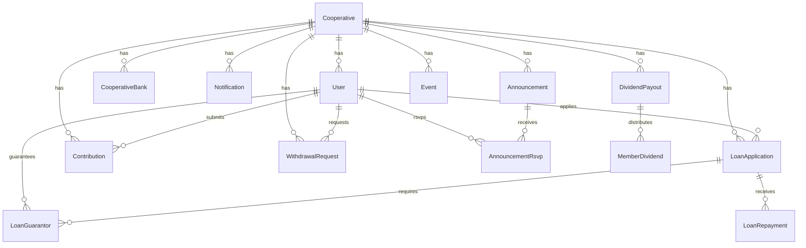

# 16 — Database Schema

## 1. Schema Overview

- **Database:** PostgreSQL (hosted on Neon)
- **ORM:** Prisma 7
- **Primary keys:** All PKs are `String @id @default(cuid())` — 25-character CUID v1 strings
- **Tables:** 17 total — 3 better-auth internal (`account`, `session`, `verification`) + 14 domain tables
- **Monetary fields:** All monetary amounts use Prisma `Decimal` type, which maps to PostgreSQL `NUMERIC`. Never use `Float` for money.
- **Timestamps:** All tables have `createdAt DateTime @default(now())` and `updatedAt DateTime @updatedAt`

---

## 2. Entity Relationship Diagram



---

## 3. Table Documentation

### 3.1 `Cooperative`

The root tenant entity. All other domain tables reference this via `cooperativeId`.

| Field | Type | Nullable | Default | Description |
|---|---|---|---|---|
| `id` | String (cuid) | No | cuid() | Primary key |
| `name` | String | No | — | Display name of the cooperative |
| `stripeCustomerId` | String | Yes | — | Stripe customer ID; `@unique` |
| `stripeSubscriptionId` | String | Yes | — | Active Stripe subscription ID |
| `subscriptionStatus` | CooperativeStatus | No | ACTIVE | Billing status |
| `billingCycleEnd` | DateTime | Yes | — | When current billing cycle ends |
| `borrowingMultiplier` | Int | No | 3 | Max loan = totalContributions × this |
| `guarantorCoverageMode` | String | No | "COMBINED" | OFF / COMBINED / INDIVIDUAL |
| `loanInterestRate` | Decimal | No | 10 | Annual interest rate percentage |
| `loanRepaymentMonths` | Int | No | 12 | Default repayment term in months |
| `defaultGracePeriodDays` | Int | No | 30 | Grace period before loan is "BEHIND" |
| `currency` | String | No | "NGN" | ISO currency code |
| `currencySymbol` | String | No | "₦" | Display symbol |
| `deletedAt` | DateTime | Yes | — | Soft delete timestamp |
| `createdAt` | DateTime | No | now() | |
| `updatedAt` | DateTime | No | @updatedAt | |

**Relations (outgoing):** `users`, `contributions`, `loans`, `events`, `bankAccounts`, `notifications`, `dividendPayouts`, `withdrawalRequests`, `announcements`

---

### 3.2 `User`

**Table name (mapped):** `user`

One cooperative member or admin. Email is globally unique — a person cannot be a member of two cooperatives with the same email.

| Field | Type | Nullable | Default | Description |
|---|---|---|---|---|
| `id` | String (cuid) | No | cuid() | Primary key |
| `cooperativeId` | String | No | — | FK → Cooperative.id |
| `email` | String | No | — | `@unique` across all cooperatives |
| `emailVerified` | Boolean | No | false | Set by better-auth after email link click |
| `name` | String | No | — | Display name |
| `image` | String | Yes | — | Avatar URL |
| `passwordHash` | String | Yes | — | bcrypt hash (managed by better-auth) |
| `role` | UserRole | No | MEMBER | See UserRole enum |
| `monthlyContributionAmount` | String | No | "0" | Target monthly amount (stored as string) |
| `verifiedAt` | DateTime | Yes | — | When admin approved this member |
| `verifiedBy` | String | Yes | — | User.id of verifying admin |
| `invitedAt` | DateTime | Yes | — | When admin invitation was sent |
| `joinedAt` | DateTime | Yes | — | When user first signed in |
| `deletedAt` | DateTime | Yes | — | Soft delete |
| `phoneNumber` | String | Yes | — | For SMS notifications |
| `emailNotifications` | Boolean | No | true | Opt-in for email alerts |
| `smsNotifications` | Boolean | No | true | Opt-in for SMS alerts |
| `createdAt` | DateTime | No | now() | |
| `updatedAt` | DateTime | No | @updatedAt | |

**Indexes:** email (unique), implied by FK cooperativeId

---

### 3.3 `LoanApplication`

One loan request from one member. Status transitions are strictly sequenced.

| Field | Type | Nullable | Default | Description |
|---|---|---|---|---|
| `id` | String (cuid) | No | cuid() | Primary key |
| `cooperativeId` | String | No | — | FK → Cooperative.id |
| `userId` | String | No | — | FK → User.id (applicant) |
| `amountRequested` | Decimal | No | — | Original requested amount |
| `status` | LoanStatus | No | PENDING_GUARANTORS | See LoanStatus enum |
| `appliedAt` | DateTime | No | now() | |
| `interestRate` | Decimal | Yes | — | Set on approval from cooperative settings |
| `repaymentMonths` | Int | Yes | — | Set on approval |
| `totalAmountDue` | Decimal | Yes | — | principal + interest; set on approval |
| `approvedAt` | DateTime | Yes | — | |
| `repaidAt` | DateTime | Yes | — | Set when totalPaid >= totalAmountDue |
| `reviewedBy` | String | Yes | — | FK → User.id (admin who reviewed) |
| `reviewedAt` | DateTime | Yes | — | |
| `rejectionReason` | String | Yes | — | Required when REJECTED |
| `deletedAt` | DateTime | Yes | — | Soft delete |
| `createdAt` | DateTime | No | now() | |
| `updatedAt` | DateTime | No | @updatedAt | |

**Indexes:** `cooperativeId`, `userId`, `status`

**Relations:** `guarantors` (LoanGuarantor[]), `repayments` (LoanRepayment[])

---

### 3.4 `LoanGuarantor`

Junction table linking a loan to each of its two required guarantors.

| Field | Type | Nullable | Default | Description |
|---|---|---|---|---|
| `id` | String (cuid) | No | cuid() | Primary key |
| `loanId` | String | No | — | FK → LoanApplication.id |
| `guarantorId` | String | No | — | FK → User.id |
| `status` | GuarantorStatus | No | PENDING | See GuarantorStatus enum |
| `acceptedAt` | DateTime | Yes | — | Set when status = ACCEPTED |
| `rejectionReason` | String | Yes | — | Required when REJECTED |
| `deletedAt` | DateTime | Yes | — | Soft delete |
| `createdAt` | DateTime | No | now() | |
| `updatedAt` | DateTime | No | @updatedAt | |

**Unique constraint:** `@@unique([loanId, guarantorId])` — prevents duplicate guarantor assignments

**Index:** `guarantorId` — for querying "loans I'm guaranteeing"

**Business rule:** If any guarantor rejects, the loan is immediately auto-rejected (status = REJECTED). Once all guarantors accept, status advances to PENDING_ADMIN_REVIEW.

---

### 3.5 `Contribution`

A single payment submitted by (or recorded for) a member.

| Field | Type | Nullable | Default | Description |
|---|---|---|---|---|
| `id` | String (cuid) | No | cuid() | Primary key |
| `cooperativeId` | String | No | — | FK → Cooperative.id |
| `userId` | String | No | — | FK → User.id (contributor) |
| `amount` | Decimal | No | — | Payment amount |
| `status` | ContributionStatus | No | PENDING_VERIFICATION | See enum |
| `paymentMethod` | PaymentMethod | No | — | See PaymentMethod enum |
| `receiptUrl` | String | Yes | — | Public HTTPS URL to receipt file |
| `receiptKey` | String | Yes | — | S3 object key |
| `receiptFileName` | String | Yes | — | Original filename from browser |
| `receiptFileSize` | Int | Yes | — | File size in bytes |
| `receiptFileType` | String | Yes | — | MIME type |
| `receiptUploadedAt` | DateTime | Yes | — | When S3 upload completed |
| `rejectionCount` | Int | No | 0 | Incremented on each rejection |
| `submittedAt` | DateTime | No | now() | |
| `verifiedByUserId` | String | Yes | — | FK → User.id (verifier) |
| `verifiedAt` | DateTime | Yes | — | When verified or rejected |
| `rejectionReason` | String | Yes | — | Required when REJECTED |
| `deletedAt` | DateTime | Yes | — | Soft delete |
| `createdAt` | DateTime | No | now() | |
| `updatedAt` | DateTime | No | @updatedAt | |

**Indexes:** `cooperativeId`, `userId`, `status`

**Business rule:** A member cannot verify their own contribution (`contribution.userId !== session.user.id`).

When an admin records a contribution directly (`recordContributionForMember`), `paymentMethod` is set to `DIRECT_PAYMENT` and `status` is immediately `VERIFIED` (no receipt needed).

---

### 3.6 `LoanRepayment`

An individual payment made against an approved loan. Multiple repayments can exist per loan until `totalPaid >= totalAmountDue`.

| Field | Type | Nullable | Default | Description |
|---|---|---|---|---|
| `id` | String (cuid) | No | cuid() | Primary key |
| `loanId` | String | No | — | FK → LoanApplication.id |
| `amount` | Decimal | No | — | Payment amount for this repayment |
| `paymentType` | String | No | — | Currently always "LOAN_REPAYMENT" |
| `paidAt` | DateTime | No | — | When payment was made |
| `receiptUrl` | String | Yes | — | Optional receipt URL |
| `recordedBy` | String | Yes | — | User.id of admin who recorded (null = self-service) |
| `note` | String | Yes | — | Optional admin note |
| `createdAt` | DateTime | No | now() | |
| `updatedAt` | DateTime | No | @updatedAt | |

**Index:** `loanId`

No soft delete — repayment records are permanent.

---

### 3.7 `CooperativeBank`

Bank account(s) members transfer contributions into. Displayed on the member contribution form.

| Field | Type | Nullable | Default | Description |
|---|---|---|---|---|
| `id` | String (cuid) | No | cuid() | Primary key |
| `cooperativeId` | String | No | — | FK → Cooperative.id |
| `accountName` | String | No | — | Account holder name |
| `accountNumber` | String | No | — | Bank account number |
| `bankName` | String | No | — | Name of the bank |
| `isPreferred` | Boolean | No | false | Only one should be preferred at a time |
| `createdAt` | DateTime | No | now() | |
| `updatedAt` | DateTime | No | @updatedAt | |

**Index:** `cooperativeId`

When `isPreferred` is set to true, all other accounts for the cooperative are set to false in the same operation (`updateMany`).

---

### 3.8 `Notification`

Immutable log of all outbound messages (email and SMS). Written by `app/lib/notifications.ts`.

| Field | Type | Nullable | Default | Description |
|---|---|---|---|---|
| `id` | String (cuid) | No | cuid() | Primary key |
| `cooperativeId` | String | No | — | FK → Cooperative.id |
| `userId` | String | No | — | Recipient user ID |
| `type` | String | No | — | Notification type (e.g. LOAN_APPROVED) |
| `channel` | String | No | — | "EMAIL" or "SMS" |
| `recipient` | String | No | — | Email address or phone number |
| `subject` | String | Yes | — | Email subject line (null for SMS) |
| `body` | String | No | — | Full message body / HTML |
| `status` | String | No | "SENT" | "SENT" or "FAILED" |
| `externalId` | String | Yes | — | Resend email ID or Twilio message SID |
| `createdAt` | DateTime | No | now() | |
| `updatedAt` | DateTime | No | @updatedAt | |

**Indexes:** `cooperativeId`, `userId`, `createdAt`

The cron job queries this table to deduplicate overdue notifications (`type = "PAYMENT_OVERDUE"` within 23 hours).

---

### 3.9 `DividendPayout`

A dividend distribution run for one period and year. Must be APPROVED before being PAID (COMPLETED).

| Field | Type | Nullable | Default | Description |
|---|---|---|---|---|
| `id` | String (cuid) | No | cuid() | Primary key |
| `cooperativeId` | String | No | — | FK → Cooperative.id |
| `period` | String | No | — | Q1 / Q2 / Q3 / Q4 / ANNUAL |
| `year` | Int | No | — | Calendar year (e.g. 2025) |
| `totalProfit` | Decimal | No | — | Gross profit for the period |
| `adminCosts` | Decimal | No | — | Deducted admin costs (from % input) |
| `loanLossReserve` | Decimal | No | — | Deducted reserve (from % input) |
| `dividendPool` | Decimal | No | — | `totalProfit - adminCosts - loanLossReserve` |
| `totalMembers` | Int | No | — | Number of members who had contributions |
| `status` | String | No | "PENDING" | PENDING / APPROVED / PAID |
| `approvedAt` | DateTime | Yes | — | |
| `approvedBy` | String | Yes | — | User.id of approving admin |
| `paidAt` | DateTime | Yes | — | Set when processDividendPayout completes |
| `createdAt` | DateTime | No | now() | |
| `updatedAt` | DateTime | No | @updatedAt | |

**Index:** `cooperativeId`

**Relations:** `memberDividends` (MemberDividend[])

---

### 3.10 `MemberDividend`

One member's share of a specific DividendPayout.

| Field | Type | Nullable | Default | Description |
|---|---|---|---|---|
| `id` | String (cuid) | No | cuid() | Primary key |
| `payoutId` | String | No | — | FK → DividendPayout.id |
| `userId` | String | No | — | FK → User.id (recipient) |
| `cooperativeId` | String | No | — | Denormalised for direct querying |
| `contributionPct` | Decimal | No | — | Member's % of total verified contributions |
| `amount` | Decimal | No | — | `dividendPool × contributionPct / 100` |
| `status` | String | No | "PENDING" | PENDING / PAID |
| `paidAt` | DateTime | Yes | — | Set by processDividendPayout |
| `createdAt` | DateTime | No | now() | |
| `updatedAt` | DateTime | No | @updatedAt | |

**Indexes:** `payoutId`, `userId`, `cooperativeId`

---

### 3.11 `WithdrawalRequest`

A member's request to withdraw funds from their contribution balance.

| Field | Type | Nullable | Default | Description |
|---|---|---|---|---|
| `id` | String (cuid) | No | cuid() | Primary key |
| `userId` | String | No | — | FK → User.id |
| `cooperativeId` | String | No | — | FK → Cooperative.id |
| `amount` | Decimal | No | — | Requested withdrawal amount |
| `reason` | String | No | — | PERSONAL / EMERGENCY / LEAVING / OTHER |
| `notes` | String | Yes | — | Optional free-text notes |
| `status` | String | No | "REQUESTED" | REQUESTED / APPROVED / REJECTED / PAID |
| `rejectionReason` | String | Yes | — | Required when REJECTED |
| `approvedAt` | DateTime | Yes | — | |
| `approvedBy` | String | Yes | — | User.id of approving admin |
| `paidAt` | DateTime | Yes | — | Set by markWithdrawalPaid |
| `deletedAt` | DateTime | Yes | — | Soft delete |
| `createdAt` | DateTime | No | now() | |
| `updatedAt` | DateTime | No | @updatedAt | |

**Indexes:** `userId`, `cooperativeId`, `status`

**Business rule:** Available withdrawal = totalVerifiedContributions − activeLoanBalance. A member may only have one REQUESTED withdrawal at a time. Account must be verified before requesting.

---

### 3.12 `Announcement`

A broadcast message from admins to some or all cooperative members.

| Field | Type | Nullable | Default | Description |
|---|---|---|---|---|
| `id` | String (cuid) | No | cuid() | Primary key |
| `cooperativeId` | String | No | — | FK → Cooperative.id |
| `title` | String | No | — | Min 3 characters |
| `message` | String | No | — | Min 10 characters |
| `type` | String | No | — | AGM / MAINTENANCE / RULE_CHANGE / GENERAL |
| `recipientType` | String | No | "ALL" | ALL / MEMBERS_ONLY / ADMINS_ONLY |
| `recipientRole` | String | Yes | — | Reserved for future role-specific targeting |
| `agmDate` | DateTime | Yes | — | Date of AGM (type = AGM only) |
| `agmLocation` | String | Yes | — | Location of AGM |
| `allowRsvp` | Boolean | No | false | Whether members can RSVP |
| `isPinned` | Boolean | No | true | Shown at top of announcement list |
| `isActive` | Boolean | No | true | False after deactivateAnnouncement |
| `expiresAt` | DateTime | Yes | — | Optional expiry date |
| `createdBy` | String | No | — | FK → User.id (creator) |
| `createdAt` | DateTime | No | now() | |
| `updatedAt` | DateTime | No | @updatedAt | |

**Indexes:** `cooperativeId`, `(isActive, isPinned)`

**Relations:** `rsvps` (AnnouncementRsvp[])

---

### 3.13 `AnnouncementRsvp`

One member's RSVP response to one announcement.

| Field | Type | Nullable | Default | Description |
|---|---|---|---|---|
| `id` | String (cuid) | No | cuid() | Primary key |
| `announcementId` | String | No | — | FK → Announcement.id |
| `userId` | String | No | — | FK → User.id |
| `rsvpStatus` | String | No | — | ATTENDING / NOT_ATTENDING / MAYBE |
| `createdAt` | DateTime | No | now() | |
| `updatedAt` | DateTime | No | @updatedAt | |

**Unique constraint:** `@@unique([announcementId, userId])` — one RSVP per member per announcement. Upserted with `prisma.announcementRsvp.upsert` when a member changes their response.

**Index:** `announcementId`

---

### 3.14 `Event`

Append-only audit log. Every significant state change writes an Event row inside a transaction.

| Field | Type | Nullable | Default | Description |
|---|---|---|---|---|
| `id` | String (cuid) | No | cuid() | Primary key |
| `cooperativeId` | String | No | — | FK → Cooperative.id |
| `eventType` | String | No | — | Snake_case string; see section 7 |
| `actorId` | String | Yes | — | User.id of who triggered the event |
| `actorType` | String | Yes | — | "user", "admin", "treasurer", "system" |
| `entityType` | String | Yes | — | Domain entity: "loan", "contribution", etc. |
| `entityId` | Int | Yes | — | Legacy integer ID (unused in current schema) |
| `data` | Json | No | — | Event-specific payload (IDs, amounts, reasons) |
| `deletedAt` | DateTime | Yes | — | Present in schema but never set |
| `createdAt` | DateTime | No | now() | |
| `updatedAt` | DateTime | No | @updatedAt | |

**Indexes:** `(cooperativeId, createdAt)`, `eventType`

The `Event` table has no soft deletes in practice. `getAuditTrail()` reads a max of 500 events ordered by `createdAt DESC`.

---

### 3.15 Better-auth Internal Tables

These three tables are managed entirely by the better-auth library. Do not write to them directly.

| Table | Purpose |
|---|---|
| `account` | OAuth account links (not used — only email/password auth enabled) |
| `session` | Active sessions; `expiresAt` = 30 days from creation |
| `verification` | Email verification tokens; `@@unique([identifier, value])` |

---

## 4. Enums

### `CooperativeStatus`
| Value | Meaning |
|---|---|
| `ACTIVE` | Subscription current; all features available |
| `PAST_DUE` | Payment failed; grace period active |
| `CANCELED` | Subscription ended; read-only access |

### `UserRole`
| Value | Meaning |
|---|---|
| `MEMBER` | Regular cooperative member; must be verified to apply for loans/withdrawals |
| `TREASURER` | Can verify contributions and record repayments; cannot approve loans or manage members |
| `ADMIN` | Can do everything TREASURER can + approve/reject loans + verify/remove members; cannot change roles |
| `OWNER` | Full control; created when a cooperative is registered; auto-verified; role is immutable |

### `LoanStatus`
| Value | Meaning |
|---|---|
| `PENDING_GUARANTORS` | Initial state; waiting for both guarantors to respond |
| `PENDING_ADMIN_REVIEW` | Both guarantors accepted; awaiting admin decision |
| `APPROVED` | Admin approved; loan is active; repayments expected |
| `REJECTED` | Rejected by guarantor or admin; terminal state |
| `REPAID` | `totalPaid >= totalAmountDue`; terminal state |

### `GuarantorStatus`
| Value | Meaning |
|---|---|
| `PENDING` | Guarantor has not yet responded |
| `ACCEPTED` | Guarantor accepted responsibility |
| `REJECTED` | Guarantor declined; triggers auto-rejection of the loan |

### `ContributionStatus`
| Value | Meaning |
|---|---|
| `PENDING_VERIFICATION` | Submitted by member; awaiting admin/treasurer review |
| `VERIFIED` | Confirmed; counts towards borrowing capacity and dividend allocation |
| `REJECTED` | Not accepted; does not count; `rejectionReason` required |

### `PaymentMethod`
| Value | Meaning |
|---|---|
| `BANK_TRANSFER` | Member transferred to cooperative bank account |
| `MOBILE_MONEY` | Mobile money payment |
| `CASH` | Physical cash payment |
| `DIRECT_PAYMENT` | Recorded directly by admin/treasurer (auto-verified, no receipt) |

---

## 5. Key Business Rules Enforced by Schema

1. **Global email uniqueness** — `User.email` has `@unique`. A person cannot have accounts in two cooperatives using the same email.

2. **LoanGuarantor uniqueness** — `@@unique([loanId, guarantorId])` prevents the same person from being listed twice as guarantor on the same loan. A `MEMBER` also cannot guarantee their own loan (enforced at application layer).

3. **AnnouncementRsvp uniqueness** — `@@unique([announcementId, userId])` ensures one RSVP per member. The `upsert` pattern allows changing the response.

4. **Cooperative isolation via FK** — `cooperativeId` on every domain table is `NOT NULL` with a FK to `Cooperative`. Cascade deletes are configured (`onDelete: Cascade`) so deleting a cooperative removes all related data.

5. **Soft deletes on key tables** — `deletedAt` on `User`, `LoanApplication`, `LoanGuarantor`, `Contribution`, `WithdrawalRequest`. All queries must add `where: { deletedAt: null }`.

6. **Reviewer cannot be applicant** — enforced at application layer in `reviewLoan` and `recordRepaymentForMember`. Schema does not prevent it directly.

7. **Verifier cannot be contributor** — enforced at application layer in `verifyContribution`.

---

## 6. Soft Delete Convention

```typescript
// CORRECT — all tenant-scoped queries
await prisma.contribution.findMany({
  where: { cooperativeId, deletedAt: null }
});

// CORRECT — single record fetch
await prisma.user.findUnique({
  where: { id: userId }
  // Note: findUnique by PK doesn't need deletedAt filter for existence check,
  // but downstream code should check deletedAt on the returned record
});

// WRONG — missing soft delete filter
await prisma.loanApplication.findMany({
  where: { cooperativeId }  // will return deleted loans!
});
```

Tables that support soft delete: `Cooperative`, `User`, `LoanApplication`, `LoanGuarantor`, `Contribution`, `WithdrawalRequest`.

Tables that do NOT support soft delete: `LoanRepayment`, `CooperativeBank`, `Notification`, `DividendPayout`, `MemberDividend`, `Announcement`, `AnnouncementRsvp`, `Event`.

---

## 7. Audit Pattern

The `Event` table is append-only. Every Server Action that performs a state change creates an Event row inside the same Prisma transaction:

```typescript
await prisma.$transaction(async (tx) => {
  await tx.loanApplication.update({ ... });
  await tx.event.create({
    data: {
      cooperativeId,
      eventType: "loan_application_approved",
      actorId: session.user.id,
      actorType: "admin",
      entityType: "loan",
      data: { loanId, decision, amount }
    }
  });
});
```

If the transaction rolls back, the event is also rolled back — the audit log stays consistent with the actual state.

The `data` field is `Json` — any serialisable payload. Common fields in `data`: entity IDs, amounts, decision outcomes, user names.

---

## 8. Decimal vs Float

**All monetary fields use Prisma `Decimal`**, which maps to PostgreSQL `NUMERIC` (arbitrary precision). This avoids floating-point rounding errors for financial calculations.

When reading a `Decimal` field in JavaScript, you must convert it:
```typescript
const amount = Number(loan.amountRequested);  // Convert Decimal → JS number
```

Do **not** use `Float` for any money field. `Float` maps to `DOUBLE PRECISION` which cannot represent all decimal fractions exactly (e.g. `0.1 + 0.2 !== 0.3`).

Fields that are `Decimal`:
- `Cooperative.loanInterestRate`
- `LoanApplication.amountRequested`, `interestRate`, `totalAmountDue`
- `Contribution.amount`
- `LoanRepayment.amount`
- `DividendPayout.totalProfit`, `adminCosts`, `loanLossReserve`, `dividendPool`
- `MemberDividend.contributionPct`, `amount`
- `WithdrawalRequest.amount`
